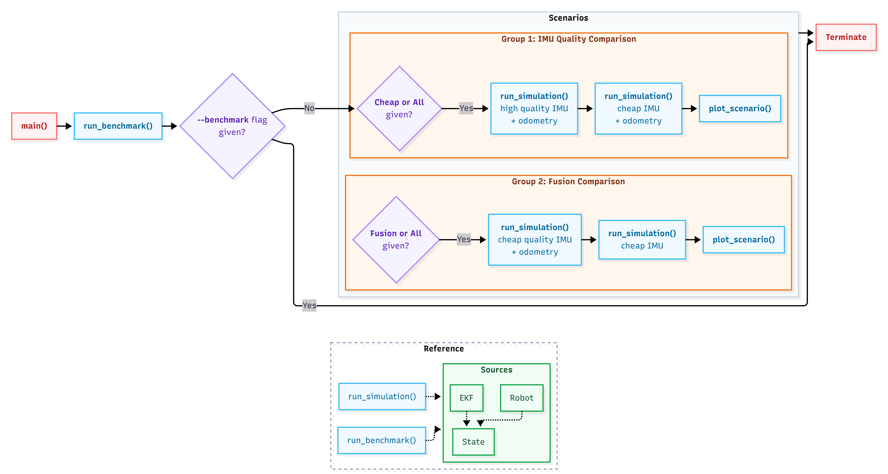

# Robot Sensor Fusion

EKF-based sensor fusion for a wheeled robot, fusing IMU and wheel odometry
to estimate position and velocity in real time.

## Requirements

- Python 3.9+
- numpy, matplotlib, pytest (see `requirements.txt`)

```bash
pip install -r requirements.txt
```

## Project structure

```
robot-sensor-fusion/
├── src/
│   ├── robot.py      # Unicycle kinematic model (ground truth)
│   ├── sensors.py    # Virtual IMU and wheel odometry with tunable noise
│   └── ekf.py        # Extended Kalman Filter
├── tests/
│   └── test_sensor_fusion.py
├── plots/            # Generated simulation outputs
├── main.py           # Simulation harness and evaluation scenarios
└── requirements.txt
```

## Execution flow


## Running the demos

```bash
# All scenarios + performance benchmark
python main.py

# Performance benchmark only
python main.py --benchmark

# Specific scenario
python main.py --scenario cheap    # high-quality vs cheap IMU
python main.py --scenario fusion   # full fusion vs IMU-only dead-reckoning
```

Plots are saved to `plots/`.

## Running the tests

```bash
pytest tests/ -v
```

## Design overview

### State vector

```
x = [px, py, theta, v, omega]
```

| Symbol | Meaning             | Unit  |
|--------|---------------------|-------|
| px, py | Position            | m     |
| theta  | Heading             | rad   |
| v      | Linear velocity     | m/s   |
| omega  | Angular velocity    | rad/s |

### Algorithm: Extended Kalman Filter

An Extended Kalman Filter (EKF) is used for nonlinear state estimation.

Why EKF is used
1. **Computational efficiency**
   The system must operate at 1 kHz. The EKF predict step is lightweight and avoids sampling based methods.

2. **Moderate nonlinearity**
   The unicycle motion model introduces a single trigonometric coupling between heading and position, which is well handled by first order linearisation.

3. **Low dimensional state**
   The state is five dimensional, making EKF sufficient compared to UKF or particle filters.

4. **Commercial suitability**
   The implementation uses only NumPy and standard Python libraries.

### Sensor models

**IMUSensor** (`IMUSensor`)
The IMU model includes Gaussian noise and bias drift.

Noise model:
```
measurement = true_value + N(0, noise_std) + bias
```

Bias evolves as a discrete time random walk:
```
bias(t+dt)  = bias(t) + N(0, bias_drift * sqrt(dt))
```

| Preset        | gyro_noise_std | gyro_bias_drift |
|---------------|----------------|-----------------|
| High-quality  | 0.001 rad/s    | 0.00001 rad/s/s |
| Cheap         | 0.05 rad/s     | 0.01 rad/s/s    |

The IMU provides high frequency angular velocity and linear acceleration measurements used in the EKF prediction step. The angular velocity is used directly in the motion model, while linear acceleration is projected onto the robot heading to update linear velocity.

**WheelOdometrySensor** (`WheelOdometrySensor`)

The odometry model simulates a differential drive system by converting wheel velocities into linear and angular velocity estimates. Gaussian noise is added independently to each wheel. Optional slip events can randomly zero one wheel to simulate wheel loss of traction.

### Predict vs update rates

| Step    | Trigger        | Typical rate |
|---------|----------------|--------------|
| predict | IMU reading    | 1 kHz        |
| update  | Odometry tick  | 50 Hz        |

The prediction step propagates state and covariance using high frequency IMU measurements. The update step corrects drift using wheel odometry.

### Performance

All matrices are preallocated during initialisation to reduce overhead in the real time loop. The update step uses an explicit analytic inverse for the 2x2 innovation covariance matrix instead of a general matrix inversion.

Typical measured performance on a modern laptop (results are hardware dependent and may vary with Python build):

| Operation | Time     |
|-----------|----------|
| predict() | ~5 µs    |
| update()  | ~8 µs    |

Both are well within the 1 kHz (1000 µs) budget.
